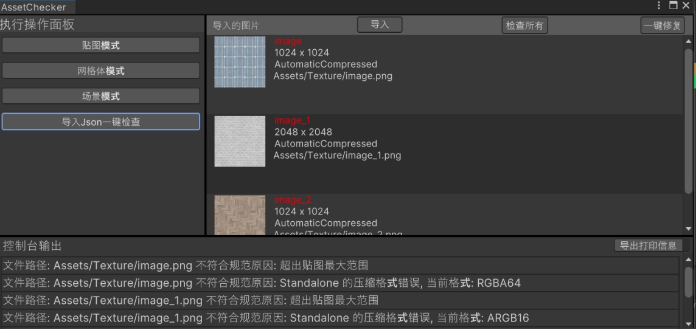
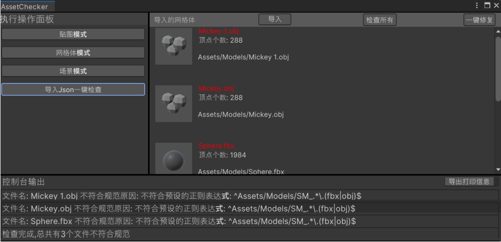
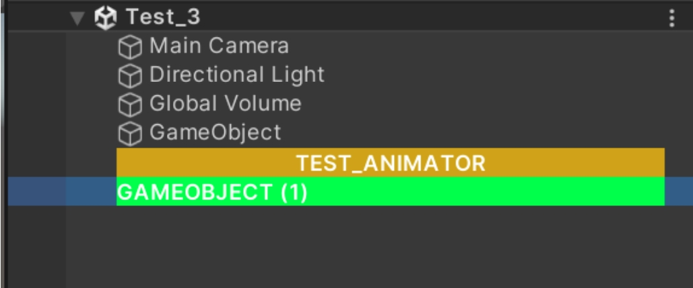
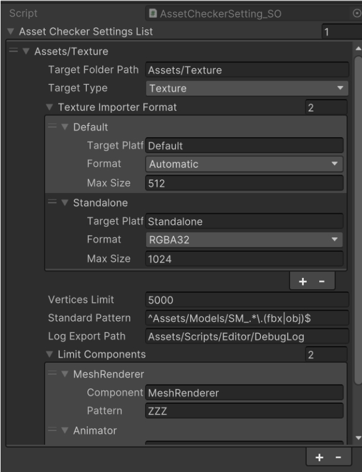
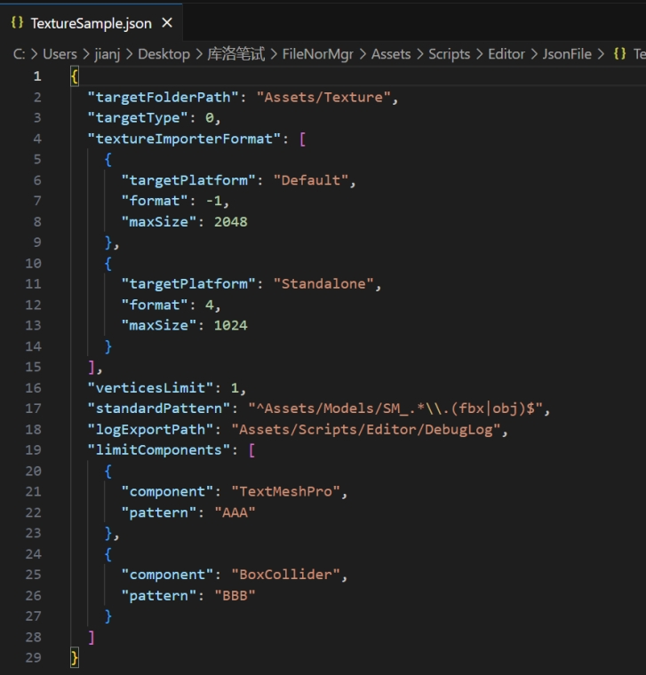

# Unity 资源检查工具 - 用户指南

## 1. 简介
本工具是一个 Unity 插件，提供直观的 UI 面板，允许用户快速检查指定文件目录中的贴图、模型和场景资源。通过一键检查，可发现不符合项目规范的问题，如贴图格式、模型顶点数、非法组件等，以提高开发效率和资源管理的规范性。

## 2. 安装与启动

### 2.1 安装插件
1. 在项目中导入 UnityPackage。
2. 在 Unity 菜单栏找到 `工具（Tool）`，下拉菜单选择 `AssetChecker`。

### 2.2 打开工具面板
- 点击 `AssetChecker`，弹出检查面板。

## 3. 界面介绍
工具面板包含以下主要部分：
1. **检查选项** – 选择需要检查的资源类型（贴图 / 模型 / 场景）。
2. **导入** – 弹出窗口让用户选择一个文件夹进行检查。
3. **检查按钮** – 触发检查功能并显示结果，有问题的资源名字会变红。
4. **打印信息显示区域** – 显示操作是否成功以及检测出的资源问题，可导出 XML 格式。
5. **一键导入 JSON 文件并检测** – 支持选择一个 JSON 文件直接进行自动检查。

## 4. 功能介绍

### 4.1 贴图检查
该功能检查所有贴图的以下属性：
- **最大压缩尺寸**：检查贴图是否超出目标平台允许的最大尺寸。
- **压缩格式**：验证贴图的压缩格式是否正确（如 Android 平台应使用 ETC2 压缩格式）。

**示例检测规则**：
- 若发现某贴图超出 2048x2048，将会打印信息。
- 若 iOS 平台使用了 ETC2 压缩，会打印信息。
- 

### 4.2 模型检查
该功能检测模型文件（FBX/OBJ）的以下属性：
- **顶点数量**：确保模型顶点数符合项目性能要求，不符合规定在 Tool 的 UI 爆红。
- **文件命名规范**：通过正则表达式检查模型命名是否符合团队约定。

**示例检测规则**：
- 若模型顶点数超过 10 万，将会打印信息。
- 若模型命名不符合 `model_XXXX.fbx` 格式，会打印信息。
- 

### 4.3 场景检查
该功能检查当前场景中的物体，确保其不包含非法或不符合规范的组件。
- **非法组件检查**：检测物体是否挂载了不允许的组件（如未授权的脚本）。
- **非法组件标记**：非法的 GameObject 名字会加上前缀，配合插件 `ColorfulHierarchy` 可直接爆红显示在场景物品列表中。

**示例检测规则**：
- 若某 GameObject 包含未授权的 `CustomScript.cs`，会提示错误。
- 若一个名叫 `GameActor` 的场景物体有非法组件，其名字会变成自定义前缀 `_GameActor`。
- 

### 4.4 快速查找本地目录
该功能支持用户点击 UI 中的图标，自动打开该文件所在的文件夹并高亮。

## 5. 使用步骤
1. **选择目录**
   - 在工具面板中，点击 `导入`，定位到待检查的资源文件夹。
2. **选择检查类型**
   - 按下 `贴图检查`、`模型检查` 或 `场景检查` 三个按钮分别切换模式。
3. **点击“开始检查”**
   - 工具将扫描指定目录，并在结果窗口显示检测报告。
4. **查看检测结果**
   - 若发现问题，结果窗口会高亮显示问题资源，并打印具体错误信息。
5. **（可选）导出报告**
   - 通过 `导出报告` 按钮，生成可读的日志文件，便于团队共享检测结果。

## 6. 数据配置
目前每个检查文件只支持一种检查配置，比如检查特定目录下的贴图文件。暂不支持一个文件内存储多个检查设置信息。

### 6.1 ScriptableObject（Inspector 窗口）
- 当没有 JSON 文件时，默认数据存储在 ScriptableObject 中。
- 可以直接在 Inspector 编辑，操作简单。
- 

### 6.2 JSON 表（其他窗口）
该工具支持用户选择任意地址的 JSON 表进行配置。
- 读取更加灵活，但修改稍微麻烦，因为贴图格式是一个枚举，需要找到对应的数字。
- 

## 7. 目前的 Bug 及不足

### **Bug**
- **导入模型资源后，缩略图显示异常**：刷新后正常，因缩略图非同步加载，导致图片为空。
- **修改贴图 Default 平台后，Inspector 的 Default 页签 UI 不会更新**：Debug 显示导入 format 已更改，但 Inspector 未同步更新。
- **构建的 UI 面板有时会挤压得很小。**

### **不足**
- **不支持 Shift、Ctrl 多选和加减选**：原生 UIToolkit 不支持普通文件浏览器功能。
- **没有支持可装载多个配置信息的列表**：导致每个配置都要是一个单独的文件。
- **Debug 导出的 XML 信息未做成左右信息表格。**
- **时间有限，未自定义 `Colorful Hierarchy` 功能**，借助了插件 [Colourful Hierarchy](https://assetstore.unity.com/packages/tools/utilities/colourful-hierarchy-category-gameobject-205934)。

